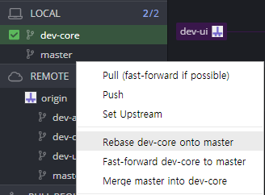

# Saucewich

### 이 프로젝트는 이전되었습니다: https://github.com/Othereum/Saucewich

## 빌드

Pull을 받고 나면 rebuild를 해야합니다. **에디터와 Visual Studio를 종료한 상태에서 진행하시기 바랍니다.**

### Without Visual Studio

1. `Binaries` 폴더가 있으면 삭제
2. `Saucewich.uproject` 열기
3. `Missing Saucewich Modules. Would you like to rebuild them now?` 와 같은 창이 뜨면 `예(Y)` 누르기

### With Visual Stuido

1. `Saucewich.uproject` 우클릭
2. `Generate Visual Studio project files` 클릭
3. `Saucewich.sln` 열기
4. Saucewich 빌드

## 작업 방식

각 팀원들은 자신에게 주어진 branch에서 작업하게 됩니다. 하나의 작업이 끝나면 master branch로 pull request를 올려야 합니다.

PR은 conflict 방지를 위해 **자주 올리는게 좋습니다** ([지속적 통합](https://ko.wikipedia.org/wiki/%EC%A7%80%EC%86%8D%EC%A0%81_%ED%86%B5%ED%95%A9) 참고). 보통 commit은 컴파일/빌드에 문제가 없는 수준의 단위로, PR은 하나의 기능이 완성되어 문제 없이 정상적으로 동작하는 단위로 올리는게 좋습니다.

게시된 PR은 수시로 검토되며 문제가 없다고 판단되면 수락되어 merge됩니다. Conflict가 발생하는 PR은 개별 논의를 거친 후에 merge됩니다.

다른 사람의 PR이 수락되어 master에 merge가 되고 나면, 자신이 작업중인 브랜치도 master와 동기화하여 최신 상태를 유지해야 할 것입니다. 그래야 다른 사람의 작업물을 자신도 사용할 수 있기 때문입니다.

이를 위해서는 자신이 작업중인 브랜치를 master로 **rebase** 또는 **fast-forward**하거나 master를 현재 브랜치로 **merge**하면 됩니다. 이 작업은 매일 작업 시작 전에 master를 pull 한 뒤 해주시기 바랍니다. 그렇지 않으면 conflict 발생 확률이 높아집니다.

## [Coding Style]

코드의 일관성을 위해 [Coding Style] 규칙을 지켜주시기 바랍니다.

[Coding Style]: https://github.com/team-sosweet/Saucewich/wiki
